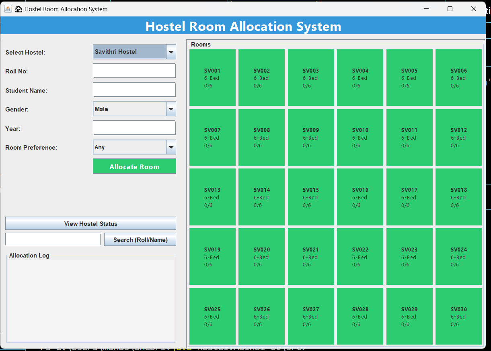
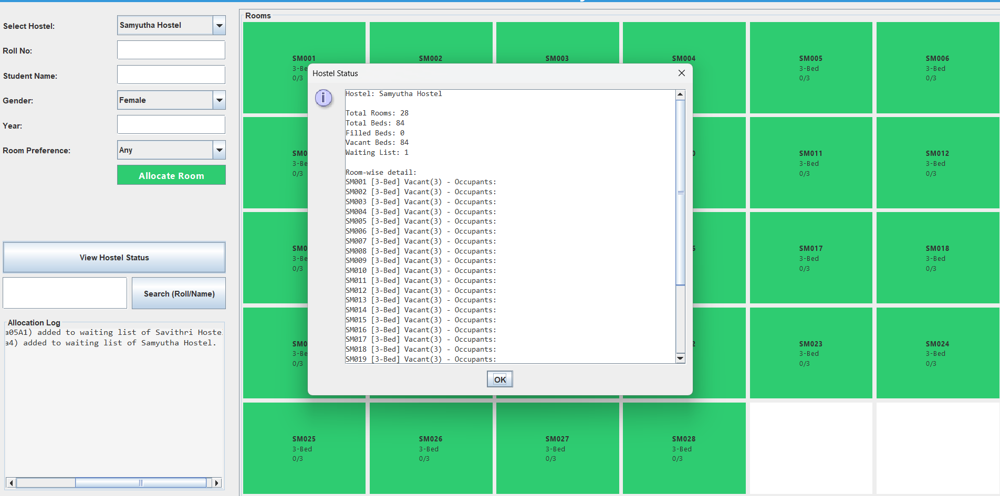
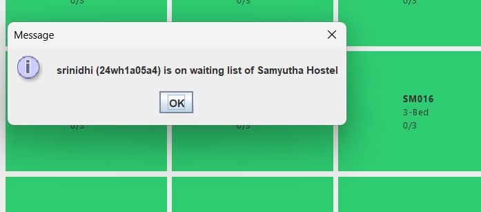

# 🏨 Hostel Room Allocation System

The **Hostel Room Allocation System** is a web-based application designed to simplify and automate the process of allocating hostel rooms to students. The system allows students to apply for hostel accommodation while enabling administrators to manage room availability, allocate rooms efficiently, and monitor hostel occupancy.

This platform improves hostel management by reducing manual work, ensuring fair room distribution, and providing an organized system for handling student accommodation requests.

---

## 📸 Screenshots

### Main Page


### Room Allocation Panel


### Search 



---

## 🚀 Features

### Student Module
- Student registration and login system
- Apply for hostel accommodation
- View allocated room details
- Track application status

### Admin Module
- Admin login and authentication
- View student hostel applications
- Allocate rooms to students
- Manage hostel room availability
- Monitor occupancy status

### Room Management
- Add or update hostel rooms
- Track available and occupied rooms
- Manage room capacity

### System Features
- Easy-to-use interface
- Organized student data management
- Efficient hostel room allocation
- Reduces manual paperwork

---

## ⚙️ Requirements

Ensure the following are installed before running the project:

- **Node.js**
- **npm (Node Package Manager)**
- **MongoDB** (if using database integration)
- Modern browser (Chrome / Edge / Firefox)

---

## 🛠️ Technology Stack

### Frontend
- HTML
- CSS
- JavaScript / React (if used)

### Backend
- Node.js
- Express.js

### Database
- MongoDB

### Tools
- Git
- GitHub
- Postman

---

## 🚀 Getting Started

### 1️⃣ Clone the Repository

```bash
git clone https://github.com/Manaswini-2512/hostel-room-allocation.git
cd hostel-room-allocation
